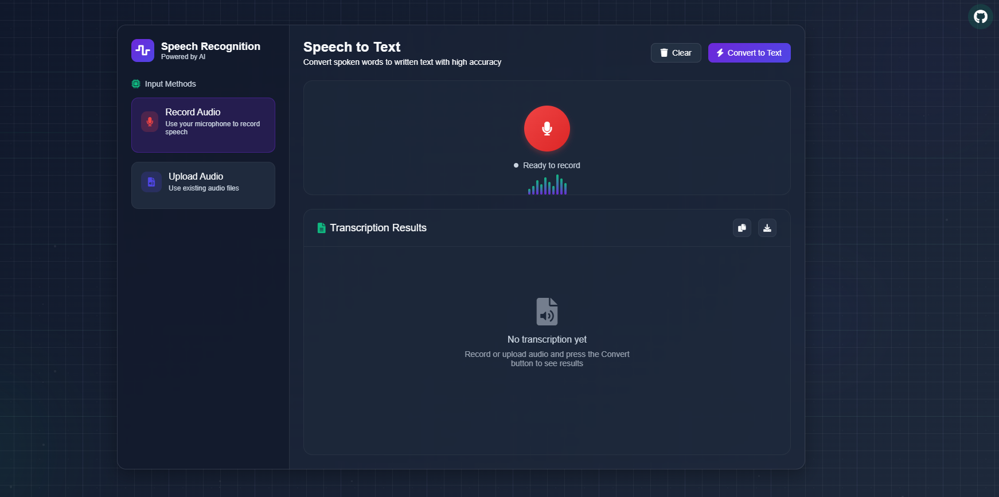
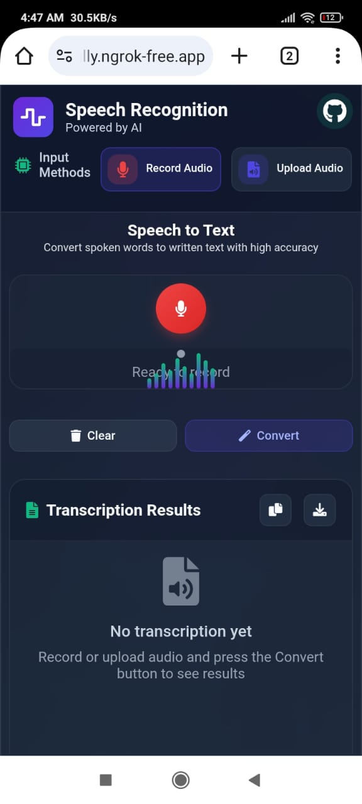

# MyraSTT - Speech-to-Text Web Application


## Overview

MyraSTT is a modern, responsive web application that provides speech-to-text transcription capabilities. The application allows users to convert spoken language into written text through both microphone recording and audio file uploads. Built with FastAPI on the backend and a clean, responsive HTML/CSS/JS interface on the frontend, MyraSTT delivers a seamless user experience across desktop and mobile devices.

## Screenshots

### Desktop View


### Mobile View


## Demo

### Features Demonstration
- **Record Audio**: Use the microphone button to start recording your voice
- **Upload Audio**: Upload pre-recorded audio files for transcription
- **Real-time Visualization**: See audio waveforms as you speak
- **Download Transcriptions**: Save your transcribed text as a file
- **Copy to Clipboard**: Quickly copy text with a single click

### Live Demo
Check out the live demo at [MyraSTT Demo](https://myra-stt.vercel.app)

## Features

- **Live Audio Recording**: Record audio directly from your microphone
- **Audio File Upload**: Upload existing audio files for transcription
- **Audio Format Support**: WAV, AIFF, FLAC, MP3, OGG, OPUS, M4A, AAC
- **Responsive Design**: Optimized for both desktop and mobile devices
- **Modern UI**: Clean interface with visualizations for audio recording/playback
- **Multi-language Support**: Transcription in various languages including English, Hindi, Gujarati, French, Spanish, German, Italian, Japanese, Korean, Chinese, and Russian

## Project Structure

```
MyraSTT/
├── api/                    # FastAPI API definitions
│   ├── __init__.py
│   ├── main.py             # Main FastAPI application
│   └── routes.py           # API route definitions
├── audio/                  # Storage for uploaded audio files
├── config/                 # Configuration settings
│   └── settings.py         # Application settings
├── core/                   # Core functionality
│   ├── file_handler.py     # Audio file handling
│   └── speech_recognition.py # Speech recognition logic
├── routes/                 # Route definitions
│   └── speech.py           # Speech recognition endpoints
├── static/                 # Static files (CSS, JS, images)
│   └── SVG/
│       ├── bot.svg         # Application logo
│       └── user.svg
├── templates/              # HTML templates
│   └── sst_core.html       # Main application interface
├── myra_sst/               # Python virtual environment
├── requirements.txt        # Project dependencies
└── README.md               # This documentation file
```

## Technologies Used

- **Backend**:

  - FastAPI: High-performance Python web framework
  - SpeechRecognition: Library for performing speech recognition
  - Uvicorn: ASGI server for serving the FastAPI application
- **Frontend**:

  - HTML5/CSS3: Modern web standards with responsive design
  - JavaScript: Client-side interactivity and audio processing
  - FontAwesome: Icon library for UI elements
  - Custom audio visualizations and controls

## Why MyraSTT?

- **Performance**: Optimized for speed and accuracy in speech recognition
- **Accessibility**: Works on any device with a browser
- **Privacy**: No data stored long-term; audio files are processed and then removed
- **Offline Capability**: Can work with local speech recognition when online services are unavailable
- **Customizable**: Easy to extend with new languages or recognition services

## Installation

### Prerequisites

- Python 3.9+
- pip (Python package manager)

### Quick Start

For Windows users, you can use the included setup script to get started quickly:

```bash
setup_and_run.bat
```

This will set up the virtual environment, install dependencies, and start the application in one step.

### Manual Setup Instructions

1. Clone the repository:

```bash
git clone https://github.com/ShivanshGhelani/Myra-SST.git
cd MyraSTT
```

2. Create and activate a virtual environment:

```bash
python -m venv myra_sst
myra_sst\Scripts\activate
```

3. Install the dependencies:

```bash
pip install -r requirements.txt
```

4. Additional requirements:
   - For offline speech recognition capabilities, install PyAudio and PocketSphinx:

```bash
pip install pyaudio pocketsphinx
```

5. Run the application:

```bash
uvicorn api.main:app --reload
```

6. Open your browser and navigate to:

```
http://localhost:8000
```

## Deployment

### GitHub Deployment

1. Initialize a Git repository:

```bash
git init
git add .
git commit -m "Initial commit"
```

2. Create a repository on GitHub and push your code:

```bash
git remote add origin https://github.com/yourusername/MyraSTT.git
git branch -M main
git push -u origin main
```

### Vercel Deployment

1. **Prepare for Vercel deployment**:
   
   Run the setup script to ensure your project is ready for Vercel:
   
   ```bash
   python vercel_setup.py
   ```

2. **Via Vercel Dashboard (Recommended)**:
   
   - Connect your GitHub repository to Vercel through their web interface
   - Set "Framework Preset" to "Other"
   - Set "Build Command" to `python vercel_setup.py`
   - Set "Output Directory" to `.`

3. **Via Vercel CLI**:

   ```bash
   # Install the CLI
   npm install -g vercel
   
   # Login to Vercel
   vercel login
   
   # Deploy
   vercel
   
   # For production
   vercel --prod
   ```

### Troubleshooting Vercel 500 Errors

If you encounter a 500 Internal Server Error on Vercel:

1. **Check logs in Vercel dashboard**:
   - Go to your deployment and view "Functions" logs

2. **Use the debug endpoint**:
   - Visit `https://your-app.vercel.app/debug` to see server environment info

3. **Common issues and fixes**:
   - **Import errors**: Make sure all files are properly imported in main.py and index.py
   - **Path errors**: Use absolute paths in your code
   - **Environment variables**: Ensure any required env vars are set in Vercel dashboard
   - **Read-only filesystem**: The app now automatically uses in-memory storage on Vercel to avoid file system errors
   - **Dependencies**: Verify all required modules are in requirements.txt

4. **Memory Storage Solution**:
   - This app now automatically detects Vercel's environment and stores audio files in memory instead of on disk
   - No code changes are needed as this is handled automatically by the application
   - If you receive the error "[Errno 30] Read-only file system: '/var/task/audio'", make sure you're using the latest version

5. **Last Resort Fix**:
   If still facing issues, try simplifying your FastAPI app code by removing complex imports and fallback to basic functionality.

## Usage

### Recording Audio

1. Open the application in your browser
2. Click on the "Record Audio" option in the sidebar
3. Press the large red microphone button to start recording
4. Speak clearly into your microphone
5. Click the button again to stop recording
6. Click "Convert to Text" to transcribe your speech
7. The transcribed text will be displayed in the results panel

### Uploading Audio Files

1. Click on the "Upload Audio" option in the sidebar
2. Select an audio file from your device
3. Click "Convert to Text" to transcribe the audio file
4. The transcribed text will be displayed in the results panel

### Managing Results

- **Copy**: Click the copy button to copy the transcribed text to clipboard
- **Download**: Click the download button to save the transcription as a text file
- **Clear**: Click the clear button to reset the application

## API Reference

### Endpoints

#### `POST /transcribe`

Transcribes an uploaded audio file.

**Request**:

- Form data with a file upload field named "file"

**Response**:

```json
{
  "text": "The transcribed text content",
  "confidence": 0.95,
  "service": "Google Speech Recognition",
  "success": true
}
```

## Development

### Directory Structure Explanation

- **api/**: Contains the FastAPI application and API route definitions
- **audio/**: Storage location for uploaded audio files
- **config/**: Configuration settings including supported formats and languages
- **core/**: Core functionality including file handling and speech recognition
- **routes/**: API route implementations
- **static/**: Static assets like SVG images
- **templates/**: HTML templates for the web interface

### Adding New Features

1. **Supporting New Audio Formats**:

   - Add the format extension to `SUPPORTED_FORMATS` in `config/settings.py`
2. **Adding New Languages**:

   - Add the language code to `SUPPORTED_LANGUAGES` in `config/settings.py`

## Browser Compatibility

- Chrome (recommended)
- Firefox
- Edge
- Safari
- Mobile browsers (Android/iOS)

## Performance Tips and Troubleshooting

### For Best Speech Recognition Results:
- Use a high-quality microphone
- Record in a quiet environment
- Speak clearly and at a moderate pace
- Position the microphone properly (about 6-8 inches from your mouth)

### Common Issues:

#### Audio Not Recording
- Make sure your browser has microphone permissions enabled
- Check if your microphone is properly connected and working
- Try refreshing the page or using a different browser

#### Low Transcription Accuracy
- Try speaking more clearly and slowly
- Reduce background noise
- Use shorter phrases or sentences
- Try uploading a higher quality audio file

#### App Not Loading
- Clear your browser cache and cookies
- Make sure you have a stable internet connection
- Disable any ad-blockers or script blockers that might interfere

## License

This project is licensed under the MIT License.

## Acknowledgments

- [SpeechRecognition](https://pypi.org/project/SpeechRecognition/) library
- [FastAPI](https://fastapi.tiangolo.com/)
- [Font Awesome](https://fontawesome.com/) for the icons

## Contact

For questions or feedback, please reach out to the project maintainer:

- GitHub: [ShivanshGhelani](https://github.com/ShivanshGhelani)
